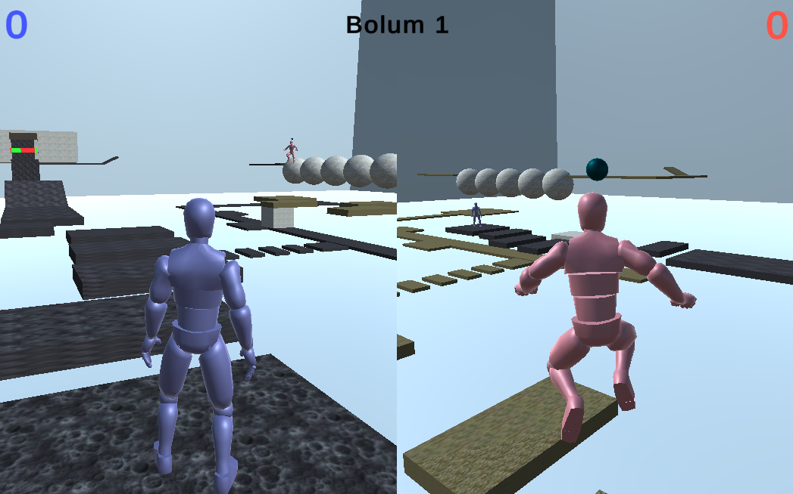

# Parkour Race
2 Player - 3D Parkour Race Game
\
Play Game (Simmer.io): <a href="https://simmer.io/@sametozkan/parkour-race-final">https://simmer.io/@sametozkan/parkour-race-final</a>

# TR
2 Kişilik 3D parkur yarış oyunu.

### Ana Menü:
Oyun, ana menü ile başlar. "Devam Et" ve "Yeni Oyun" butonları bulunur. 
- Devam Et: Mevcut kayıt yoksa pasif durumdadır. Eğer kayıt varsa kayıtlı bölümü açar.
- Yeni Oyun: Yeni oyun başlatılır.

### Oyunu durdurma:
"ESC" tuşu ile oyun durdurulabilir. "ESC" tuşuna tekrar basılması halinde menü kapanacaktır.
- Devam Et: Oyun kaldığı yerden devam eder. 
- Yeniden Başlat: Oyunu sıfırlayarak 1.Bölüm'den başlatır.
- Ana Menü: Ana menüye döner."Devam et" butonu ile oyun devam eder. "Yeniden başlat" butonu ile oyun yeniden başlar. "Ana Menu" butonu ile 

### Amaç:
Oyun 2 bölümden oluşur. Oyuncular aynı anda parkura başlarlar ve parkuru ilk bitiren oyuncu 1 puan kazanır. İki bölümü de ilk tamamlayan oyuncu oyunu kazanacaktır. Aksi halde oyun berabere biter.

### Skill:
Oyunda 2 adet skill mevcuttur. Bunlardan birisi "zıplatma", diğeri ise "rastgele kuvvet uygulama"dır. Bu iki skill, rakibi parkurdan düşürmek ve rakibe zaman kaybettirmek amacıyla kullanılır.
- Zıplatma: Rakip oyuncuyu zıplatır.
- Rastgele kuvvet uygulama: Rakip oyuncuya rastgele yönde ve büyüklükte kuvvet uygular.

### Skill kullanımı:
Her iki oyuncuya da başlangıçta skill verilir. Player1 "Left Shift" tuşuyla, Player2 ise "AltGr" tuşuyla sahip olduğu skill'i kullanabilir. Skill kullanımından 7 saniye sonra oyuncunun skill yeteneği yenilecektir. Bu 7 saniyelik bekleme süresi içerisinde oyuncu skill'e sahip olmadığı için "Left Shift" ve "AltGr" tuşlarının rakibe etkisi olmayacaktır.

### Spawn:
Parkur bölümlere ayrılmıştır ve bu bölümlerin başlangıç noktaları birer spawn noktalarıdır. Parkudan düşen oyuncu, kendisine en yakın spawn noktasından spawnlanarak parkuru oynamaya devam eder.

### Ateş etme:
Parkurun ikinci kısmına gelen oyuncu, skill tuşuyla atış etmeye başlar. Yeşil yanan blok mermi ile yok olabilir. Kırmızı yanan blok ise mermiden etkilenmez. Oyuncu, blokların tamamını temizledikten sonra kapıyı açar ve ikinci kısmı tamamlamış olur.

### Lazer:
Lazer, oyuncuya temas ettiğinde oyuncuyu bir önceki spawn noktasına ışınlar. Oyuncu bu noktadan oyuna devam eder.

### Büyük kare kütle:
Büyük kare kütle, oyuncuyla çarpıştığında oyuncuyu parkurdan düşürecektir. Bu durumda oyuncu bir önceki spawn noktasına ışınlanır ve oyuna devam eder.

### Oyun sonu:
Puan durumuna göre kazanan oyuncu belirlenir. Puan durumu eşit ise oyun beraberedir. Sonuç ekranı 3 saniye gösterildikten sonra oyuncular Ana Menü ekranına yönlendirilir.

## Kontroller

### P1 (Mavi)
    - W, A, S, D: Rotasyon & hareket
    - Space: Zıplama
    - Left Shift: Skill kullanma & Ateş etme

### P2 (Kırmızı)
    - Yön tuşları: Rotasyon & hareket
    - Right Shift: Zıplama
    - AltGr: Skill kullanma & Ateş etme

## Screenshots

## Animasyonlar
### Karakter Animasyonları
- Idle
- İleri koşma
- Geri koşma
- Zıplama

### Skill Animasyonu
- Renk değiştiren küre

## Assetler
### Görsel
- Human animasyon: <a href="https://assetstore.unity.com/packages/3d/animations/basic-motions-free-154271">https://assetstore.unity.com/packages/3d/animations/basic-motions-free-154271</a>
- Ground material: <a href="https://assetstore.unity.com/packages/2d/textures-materials/20-ground-material-sets-sci-fi-12401">https://assetstore.unity.com/packages/2d/textures-materials/20-ground-material-sets-sci-fi-12401</a>
### Ses
- Background: <a href="https://opengameart.org/content/railjet-long-seamless-loop">https://opengameart.org/content/railjet-long-seamless-loop</a>
- Spawn noktası: <a href="https://opengameart.org/content/cute-mission-complete">https://opengameart.org/content/cute-mission-complete</a>
- Ateş: <a href="https://pixabay.com/sound-effects/shotgun-firing-4-6746/">https://pixabay.com/sound-effects/shotgun-firing-4-6746/</a>
- Skill kullanma: <a href="https://opengameart.org/content/spell-4-fire">https://opengameart.org/content/spell-4-fire</a>
- Zıplama: <a href="https://pixabay.com/sound-effects/cartoon-jump-6462/">https://pixabay.com/sound-effects/cartoon-jump-6462/</a>

## Geliştiriciler
### Samet Özkan
<ul>
<b>- Vize:</b>
<ul>
    <li>Parkurun oluşturulması</li>
    <li>Oyuncu mekanikleri (Hareket, zıplama, ateş etme, skill)</li>
    <li>Parkurdaki cisimlerin mekanikleri</li>
    </ul>
     
    <b>- Final:</b>
    <ul>
    <li>Animasyonlar</li>
    <li>Oynanabilir sahneler (Asenkron sahne geçişi)</li>
    <li>Ses ve Müzik</li></ul>
</ul>

### Berkan Serbes
<ul>
<b>- Vize:</b>
<ul>
    <li>Durdurma menüsü tasarımı</li>
    <li>Durdurma menüsü kodlanması</li>
    <li>Oyun sonunda kazananı tespit etme ve oyun sonu ekranı</li>
    </ul>
     
    <b>- Final:</b>
    <ul>
    <li>Ana menü</li>
    <li>Kayıt alma</li></ul>
</ul>

## İletişim

Email: <a href="mailto:samet-ozkan@outlook.com">samet-ozkan@outlook.com</a>

